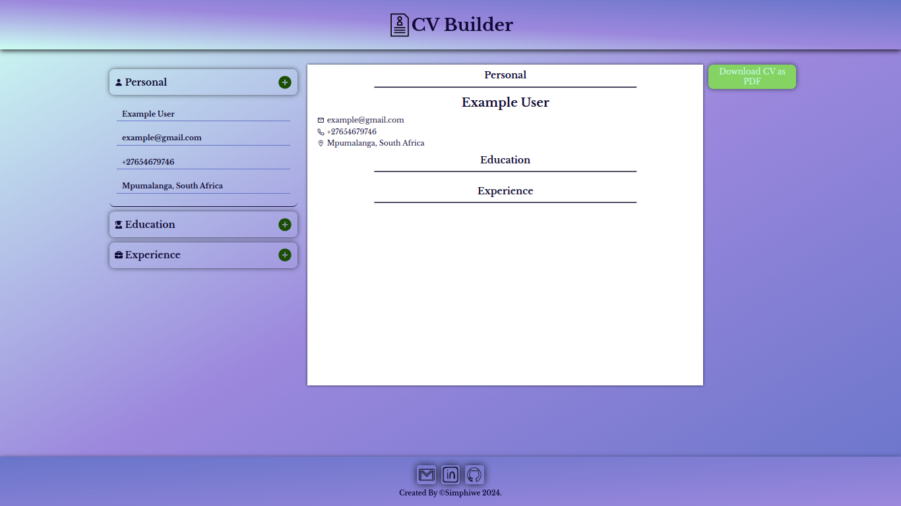
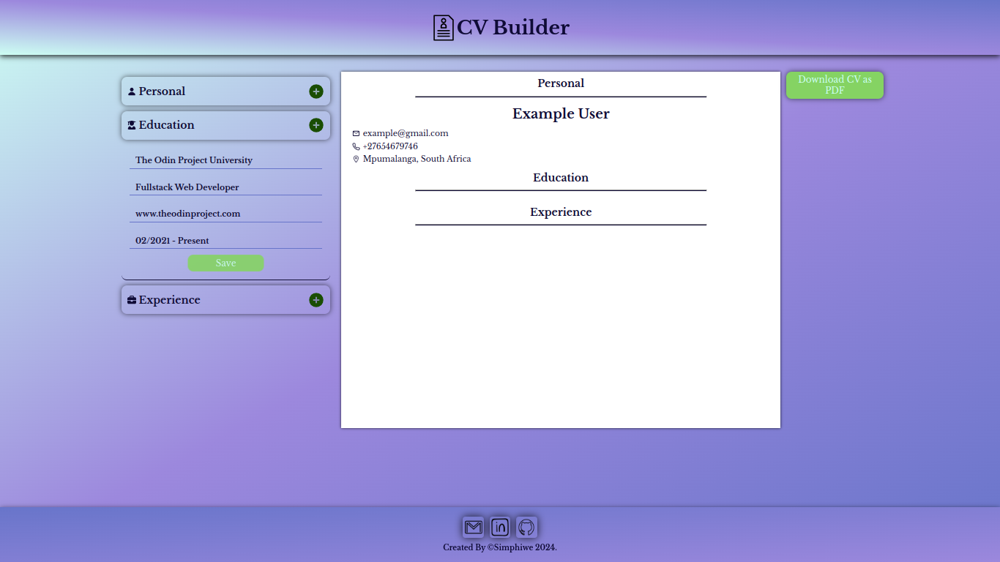
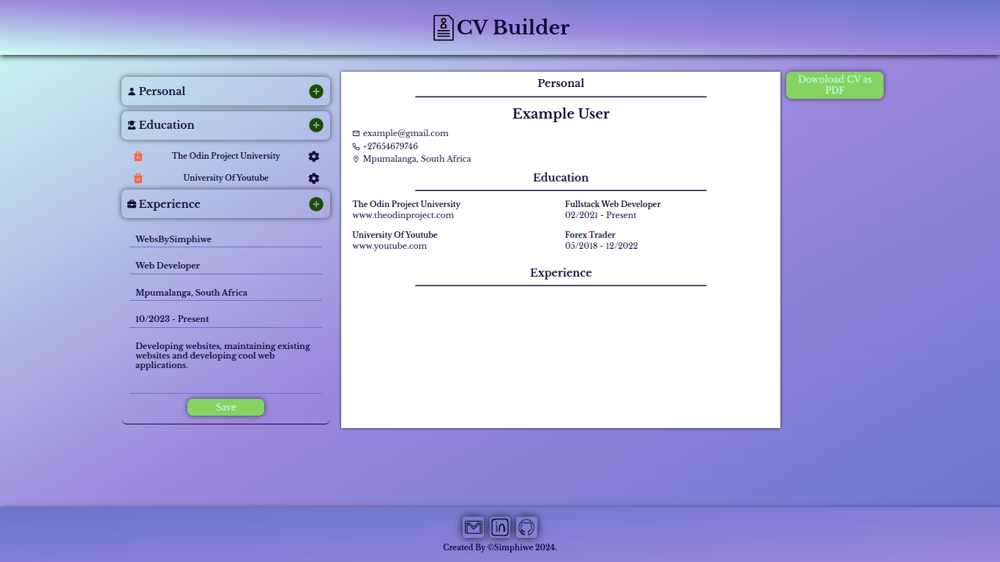
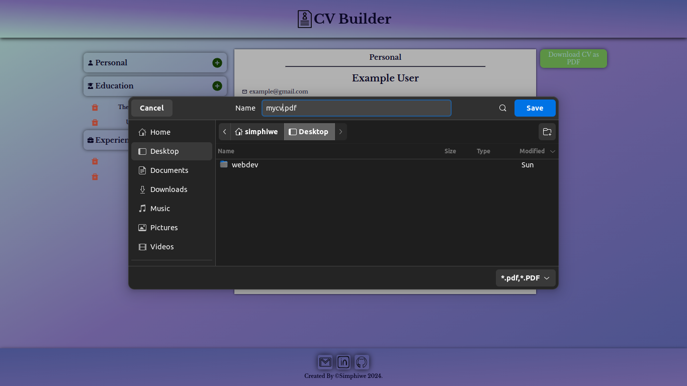

# CV BUILDER

Check it _**LIVE**_ 👉
**<https://deebest.github.io/cv-builder/>**

A _**CV Builder**_ web application I built with HTML,CSS,JavaScript and react, it let user type in their details in the browser forms and the application takes those details and make a cv for the user.

## Uses

Can be used to generate pdf cvs and download the cv to the local device.

## Tech Stack Used

- GIT
- HTML
- CSS
- JavaScript
- React

## Get In Touch 👇

Email : **<simphiwedladla8@gmail.com>**

Linked: **<https://www.linkedin.com/in/dladla-simphiwe-89061a20a/>**

Github: **<https://github.com/DeeBest>**

Portfolio: **<https://deebest.github.io/personal-webpage/>**

## More Screenshot Of The App

